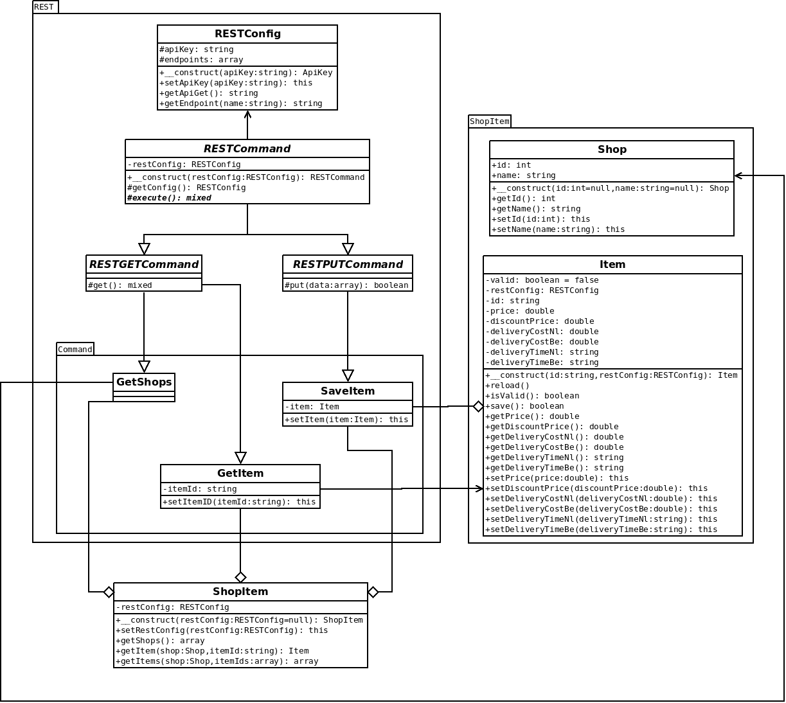

# BeslistShopItem - Beslist.nl ShopItem API #

[](https://travis-ci.org/Soneritics/BeslistShopItem)
[](https://coveralls.io/r/Soneritics/BeslistShopItem?branch=master)


by
* [@Soneritics](https://github.com/Soneritics) - Jordi Jolink


## Introduction ##
The Beslist.nl platform imports webshop inventory items using feeds. The process of feed creation,
downloading and processing all items in a feed is by nature not real-time. Therefore an API has been
developed enabling near real-time updates to a number of properties of inventory items. Within the
context of this API those webshop inventory items are referred to as ‘shopitems’ and the API is called
the ‘Shopitem API’.

## Minimum Requirements ##

- PHP 5.6

## Class Diagram ##



### Example ###

```php
// @todo: Add an example
```
